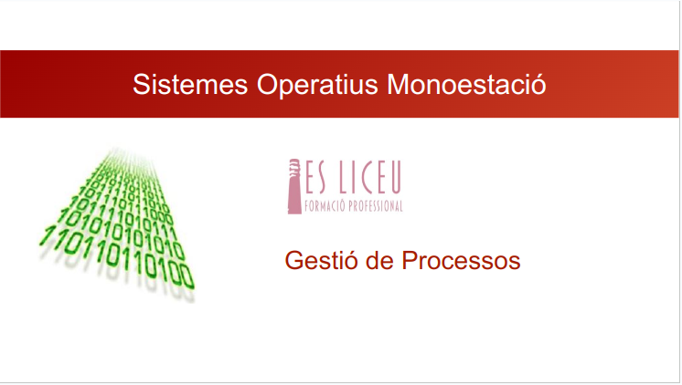

## Introducción a la Gestión de Procesos:
- La gestión de procesos es una parte fundamental del sistema operativo que controla y supervisa la ejecución de diferentes tareas o procesos. Un "proces" en este contexto es referencia a un programa en ejecución, juntament amb les seves dades associades i el espacio de memoria asignado.
**La gestión de procesos**es esencial para garantizar el funcionamiento eficiente y ordenado de un sistema operativo. En este contexto, un "proceso" no solo se limita a la ejecución de un programa, sino que también implica la gestión de recursos, la asignación de memoria y la coordinación de la ejecución de múltiples tareas concurrentes. Los sistemas operativos modernos utilizan algoritmos y políticas de planificación para optimizar la utilización de la CPU, minimizar el tiempo de espera y maximizar la capacidad de respuesta del sistema. Además, la gestión de procesos facilita la comunicación y la sincronización entre distintos programas, permitiendo una ejecución armoniosa de las operaciones del sistema. En este marco, la eficaz gestión de procesos se convierte en un pilar fundamental para asegurar un rendimiento óptimo y una experiencia de usuario fluida.
